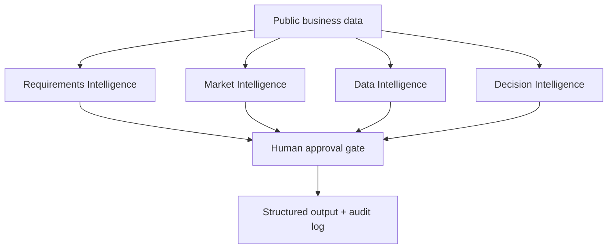
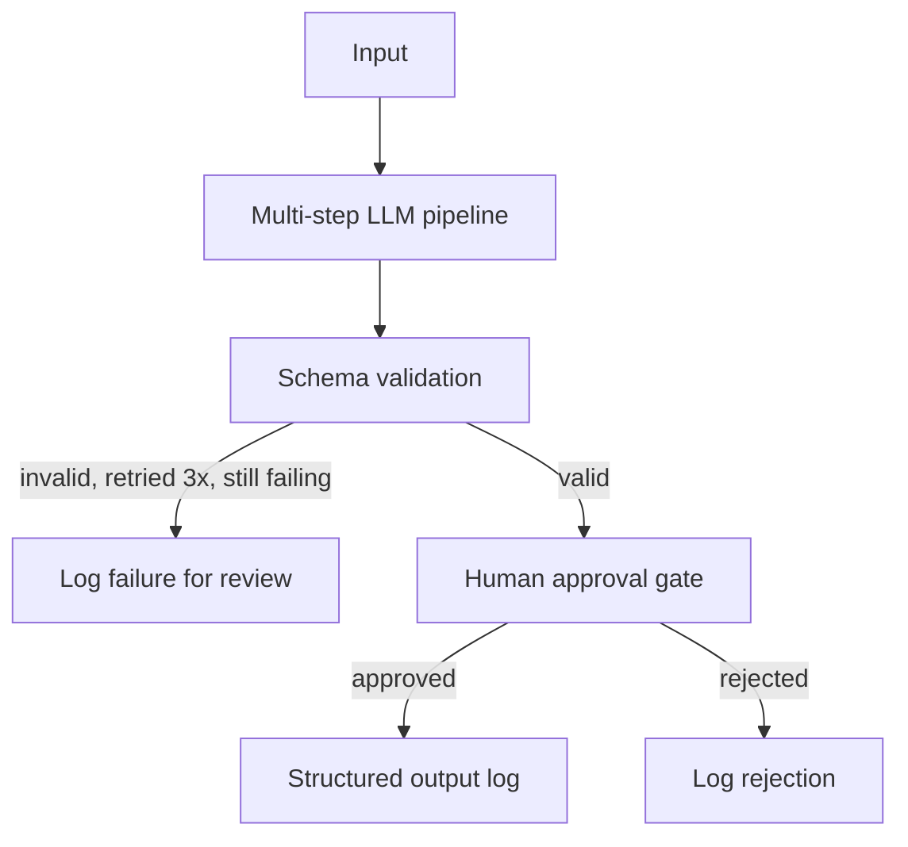

# AI Agent Suite

Four multi-step analytical agents built on [n8n]((https://kirankg.app.n8n.cloud/form/requirements-intelligence) (free, self-hosted Community Edition), each backed by Claude. Every agent follows the same architecture pattern: pull public data → run a multi-step LLM pipeline → validate the structured output → route through a **human approval gate** → log the result. The AI never finalizes a decision on its own.

This project exists to demonstrate requirements thinking, system design, and responsible-AI judgment for Business Analyst / Product Owner / AI Product Owner roles — the design decisions matter more here than the code.

## The four agents

| Agent | Input (public data) | Pipeline | Output |
|---|---|---|---|
| **Requirements Intelligence** | App Store / Play Store reviews, GitHub issues | 5 steps: extract → cluster → prioritize → draft user stories → acceptance criteria | Structured user stories, PM-approved |
| **Market Intelligence** | SEC EDGAR filings, free-tier news API | 3 steps: scan mentions → compare positioning → synthesize brief | Competitive brief with confidence levels, analyst-approved |
| **Data Intelligence** | Public sample schema (Chinook / Northwind) | 3 steps: parse schema → plan query → generate SQL | Read-only SQL query plan, analyst-approved before execution |
| **Decision Intelligence** | Outputs of the other 3 agents | 3 steps: build scenarios → simulate outcomes → score & rank | Ranked scenarios — the model never picks a final answer |

## Architecture



Each agent internally follows the same shape:



## Why this design

- **n8n, self-hosted, free** — workflows export as JSON, so they live in this repo as real, inspectable artifacts rather than being locked inside a vendor's cloud UI. See `docs/decisions-and-tradeoffs.md` for why this beat Zapier/Make for a portfolio project.
- **Public data only** — no proprietary or customer data anywhere in this project. Sources are named per agent above.
- **Retry, not silent failure** — every LLM call in `workflows/*.json` has `retryOnFail: true, maxTries: 3` at the node level (n8n's native retry), which covers rate limits and transient API errors without hand-rolled retry logic.
- **Human-in-the-loop by design** — every agent's final output is a *recommendation*, not an action. A Discord webhook notifies a reviewer; an n8n `Wait` node (resume-on-webhook) pauses the workflow until they approve or reject.

## Repo structure

```
ai-agent-suite/
├── README.md
├── docs/
│   └── decisions-and-tradeoffs.md
└── workflows/
    ├── requirements-intelligence.json
    ├── market-intelligence.json
    ├── data-intelligence.json
    └── decision-intelligence.json
```

## Running it yourself

1. `docker run -it --rm --name n8n -p 5678:5678 -v n8n_data:/home/node/.n8n docker.n8n.io/n8nio/n8n`
2. Open `http://localhost:5678`, import any file from `workflows/` (Menu → Import from File).
3. Set environment variables: `GOOGLE_API_KEY`, `DISCORD_WEBHOOK_URL` (a free Discord channel webhook works fine).
4. Each workflow starts from a Manual Trigger — set your input fields in the `Define_Input` node and execute.

**Note:** these workflows are a real, importable scaffold, not a plug-and-play product — node parameter names shift slightly across n8n versions, so verify each `HTTP Request` and `Wait` node's config against your installed version before running for real. See `docs/decisions-and-tradeoffs.md` for what's deliberately simplified and why.

## What I'd build next

- Cross-agent orchestration so Decision Intelligence auto-triggers after the other three complete, instead of taking manual input.
- A lightweight logging dashboard (Google Sheets or Airtable) instead of local JSON files, so a reviewer can see history without opening the file system.
- Swap the raw `HTTP Request` calls for n8n's native LangChain / Anthropic nodes once the project outgrows the transparency benefit of plain HTTP.
